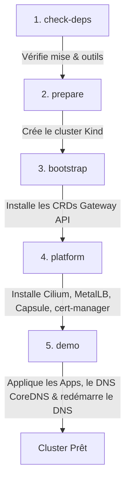
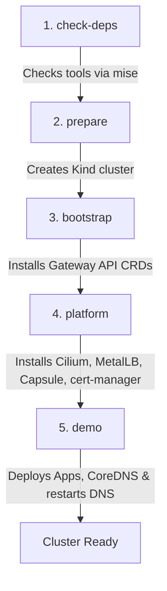

# 🔒 Kubernetes Namespace Lockdown & Internal Routing

[](#)

---

## 🇫🇷 Version Française

Ce projet démontre l'isolation réseau des namespaces (confinement egress) et le routage interne via une Gateway API (Cilium) en réutilisant des domaines publics localement.

> [!IMPORTANT]
> **Compatibilité & Prérequis :**
> - **Système d'exploitation :** Linux uniquement (le test externe `make test` interroge directement les adresses IP du réseau Docker de Kind depuis l'hôte).
> - **Sous-réseau Docker (Kind) :** Ce projet suppose que le sous-réseau alloué à Kind est `172.18.0.0/16`. Si Docker utilise une autre plage (ex: `172.19.0.0/16`) en raison d'un conflit de sous-réseau :
>   1. Modifiez la plage d'IPs dans [address.yaml](./manifests/metallb-system/address.yaml) (remplacez `172.18` par votre préfixe).
>   2. Mettez à jour les IPs cibles dans le [Makefile](./Makefile) (cible `test`).
>   *Pour vérifier le sous-réseau après création du cluster :* `docker network inspect kind -f '{{(index .IPAM.Config 0).Subnet}}'`


### 🚀 Que fait `make install` ?

La commande `make install` automatise l'installation de bout en bout de manière **100% déclarative** via les étapes suivantes :



1. **`check-deps`** : Vérifie la présence des outils indispensables (`kind`, `kubectl`, `helm`, `skaffold`). Ils peuvent être installés automatiquement avec `mise install`.
2. **`prepare`** : Crée le cluster Kubernetes local avec [kindfile.yaml](./kindfile.yaml) (si non existant).
3. **`bootstrap` (Skaffold)** : Applique les définitions de ressources (CRDs) Gateway API officielles depuis GitHub.
4. **`platform` (Skaffold)** : Déploie l'infrastructure de base (Cilium, Capsule, MetalLB, cert-manager) via Helm.
5. **`demo` (Skaffold)** : 
   - Applique le ConfigMap de réécriture DNS [coredns.yaml](./manifests/coredns.yaml) pour simuler les domaines externes localement.
   - Déploie les applications de test dans les namespaces `alpha` et `beta`.
   - Redémarre automatiquement CoreDNS (via un post-deploy hook) pour appliquer les redirections DNS.

### 🛠️ Utilisation rapide

```bash
mise install    # Installe les outils requis
make install    # Crée et configure le cluster
make test       # Valide l'isolation et le routage interne
make clean      # Supprime le cluster
```

---

## 🇬🇧 English Version

This project demonstrates Kubernetes network policy isolation (egress lockdown) and internal traffic routing via an API Gateway (Cilium), reusing public domains locally.

> [!IMPORTANT]
> **Compatibility & Prerequisites:**
> - **OS:** Linux only (the host test `make test` directly queries Docker network IPs from the host).
> - **Docker Subnet Conflict:** This project assumes the Kind Docker network subnet is `172.18.0.0/16`. If Docker assigns a different range due to a conflict (e.g., `172.19.0.0/16`):
>   1. Edit the address pool range in [address.yaml](./manifests/metallb-system/address.yaml) (replace `172.18` with your subnet prefix).
>   2. Update the target resolution IPs in the [Makefile](./Makefile) (under the `test` target).
>   *To check your current subnet after cluster creation:* `docker network inspect kind -f '{{(index .IPAM.Config 0).Subnet}}'`


### 🚀 What does `make install` do?

The `make install` command automates the entire setup in a **100% declarative** way through the following steps:



1. **`check-deps`**: Verifies that the required tools (`kind`, `kubectl`, `helm`, `skaffold`) are installed. You can install them automatically using `mise install`.
2. **`prepare`**: Bootstraps the local Kubernetes cluster using [kindfile.yaml](./kindfile.yaml) (if not already running).
3. **`bootstrap` (Skaffold)**: Deploys the official Gateway API Custom Resource Definitions (CRDs) directly from GitHub.
4. **`platform` (Skaffold)**: Deploys core infrastructure helm charts (Cilium CNI, Capsule Multi-tenancy, MetalLB, cert-manager).
5. **`demo` (Skaffold)**: 
   - Applies the declarative DNS rewrite ConfigMap [coredns.yaml](./manifests/coredns.yaml).
   - Deploys test applications and isolation rules in namespaces `alpha` and `beta`.
   - Triggers an automated rollout restart of CoreDNS (via a post-deploy hook) to apply the DNS updates.

### 🛠️ Quick Start

```bash
mise install    # Installs required tools
make install    # Sets up the cluster and apps
make test       # Runs network isolation tests
make clean      # Destroys the cluster
```
